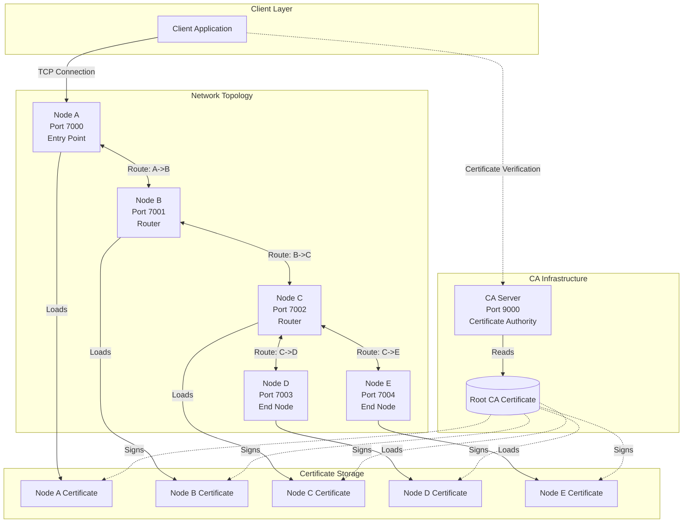
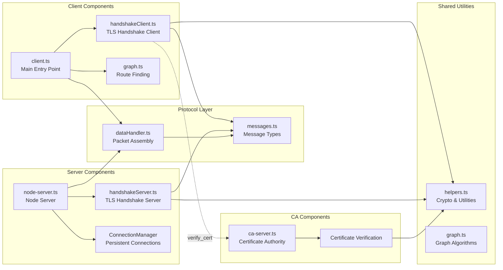
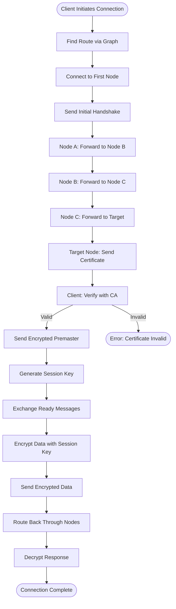
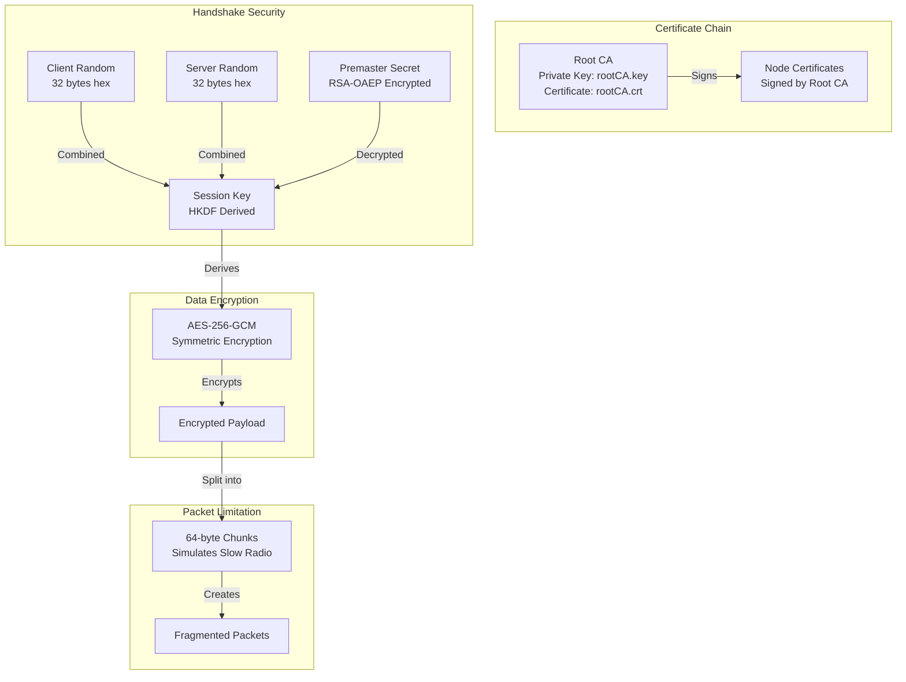
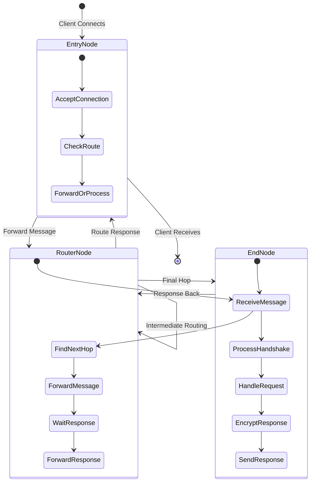

# Architecture Overview

This document describes the high-level architecture of the TLS Topology RGR project.

## System Architecture Diagram

## Component Architecture

## Data Flow Architecture

## Security Architecture

## Node Role Architecture

