# Infrastructure and Deployment

This document describes the infrastructure setup, network topology, and deployment architecture.

## Network Topology


## Infrastructure Components


## Port Allocation

| Component | Port | Protocol | Description |
|-----------|------|----------|-------------|
| CA Server | 9000 | TCP | Certificate Authority service |
| Node A | 7000 | TCP | Entry point node |
| Node B | 7001 | TCP | Intermediate router |
| Node C | 7002 | TCP | Router hub (connects to D and E) |
| Node D | 7003 | TCP | End node |
| Node E | 7004 | TCP | End node |

## Connection Flow Infrastructure


## YAML Infrastructure Description

For tools that support YAML-based infrastructure diagrams, here's a structured description:

```yaml
infrastructure:
  name: "TLS Topology RGR"
  version: "1.0"
  
  components:
    - name: "CA Server"
      type: "service"
      port: 9000
      protocol: "TCP"
      resources:
        - type: "file"
          path: "secrets/rootCA.crt"
          purpose: "Root certificate authority"
        - type: "file"
          path: "secrets/rootCA.key"
          purpose: "Root private key"
      responsibilities:
        - "Certificate verification"
        - "Certificate validation"
        - "Hostname verification"
    
    - name: "Node A"
      type: "node"
      port: 7000
      protocol: "TCP"
      role: "entry_point"
      resources:
        - type: "file"
          path: "secrets/node_A/A.key"
          purpose: "Private key"
        - type: "file"
          path: "secrets/node_A/A.crt"
          purpose: "Certificate"
      connections:
        - target: "Node B"
          port: 7001
          type: "bidirectional"
    
    - name: "Node B"
      type: "node"
      port: 7001
      protocol: "TCP"
      role: "router"
      resources:
        - type: "file"
          path: "secrets/node_B/B.key"
          purpose: "Private key"
        - type: "file"
          path: "secrets/node_B/B.crt"
          purpose: "Certificate"
      connections:
        - target: "Node A"
          port: 7000
          type: "bidirectional"
        - target: "Node C"
          port: 7002
          type: "bidirectional"
    
    - name: "Node C"
      type: "node"
      port: 7002
      protocol: "TCP"
      role: "router_hub"
      resources:
        - type: "file"
          path: "secrets/node_C/C.key"
          purpose: "Private key"
        - type: "file"
          path: "secrets/node_C/C.crt"
          purpose: "Certificate"
      connections:
        - target: "Node B"
          port: 7001
          type: "bidirectional"
        - target: "Node D"
          port: 7003
          type: "bidirectional"
        - target: "Node E"
          port: 7004
          type: "bidirectional"
    
    - name: "Node D"
      type: "node"
      port: 7003
      protocol: "TCP"
      role: "end_node"
      resources:
        - type: "file"
          path: "secrets/node_D/D.key"
          purpose: "Private key"
        - type: "file"
          path: "secrets/node_D/D.crt"
          purpose: "Certificate"
      connections:
        - target: "Node C"
          port: 7002
          type: "bidirectional"
    
    - name: "Node E"
      type: "node"
      port: 7004
      protocol: "TCP"
      role: "end_node"
      resources:
        - type: "file"
          path: "secrets/node_E/E.key"
          purpose: "Private key"
        - type: "file"
          path: "secrets/node_E/E.crt"
          purpose: "Certificate"
      connections:
        - target: "Node C"
          port: 7002
          type: "bidirectional"

  topology:
    description: "Graph-based routing topology"
    route_map: "A:B,B:C,C:D,C:E"
    algorithm: "BFS (Breadth-First Search)"
    routing:
      method: "source_routing"
      route_inclusion: "in_message_header"
    
  constraints:
    packet_size:
      max_bytes: 64
      purpose: "Simulate slow radio channel"
      implementation: "sendWithPacketLimit()"
    
  security:
    certificate_chain:
      root: "Root CA"
      nodes: "All nodes signed by Root CA"
    encryption:
      handshake: "RSA-OAEP"
      data: "AES-256-GCM"
      key_derivation: "HKDF"
```

## Deployment Architecture


## Network Constraints and Limitations

```mermaid
graph LR
    subgraph "Packet Constraints"
        LargeMessage[Large Message<br/>Any Size]
        Splitter[Packet Splitter<br/>64-byte chunks]
        Chunk1[Chunk 1<br/>64 bytes]
        Chunk2[Chunk 2<br/>64 bytes]
        ChunkN[Chunk N<br/>≤64 bytes]
    end
    
    subgraph "Reassembly"
        Buffer[DataHandler Buffer]
        HeaderParser[Header Parser<br/>Content-Length]
        Reassembler[Message Reassembler]
        CompleteMessage[Complete Message]
    end
    
    LargeMessage --> Splitter
    Splitter --> Chunk1
    Splitter --> Chunk2
    Splitter --> ChunkN
    
    Chunk1 --> Buffer
    Chunk2 --> Buffer
    ChunkN --> Buffer
    Buffer --> HeaderParser
    HeaderParser --> Reassembler
    Reassembler --> CompleteMessage
```



## Infrastructure Text Description (for YAML tools)

```
Infrastructure Components:
- CA Server (Port 9000): Central certificate authority
  - Validates node certificates
  - Verifies certificate chain
  - Checks hostname matching
  
- Node Servers (Ports 7000-7004): Distributed network nodes
  - Each node runs as separate process
  - Maintains persistent connections to neighbors
  - Routes messages based on route header
  - Handles TLS handshake for final destination
  
- Client Application: Initiates connections
  - Connects to entry node (Node A)
  - Performs TLS handshake through route
  - Sends encrypted data
  - Receives encrypted responses

Network Topology:
- Graph structure: A->B->C, C->D, C->E
- Bidirectional edges (full duplex)
- Route finding via BFS algorithm
- Source routing (route in message header)

Constraints:
- Packet size limit: 64 bytes (simulates slow radio)
- Message fragmentation and reassembly
- Content-Length based message parsing
```

