# Protocol Flow and Message Exchange

This document describes the detailed protocol flows, message sequences, and handshake procedures.

## Complete TLS Handshake Flow


## Data Exchange Flow


## Message Routing Flow

```mermaid
flowchart TD
    Start([Message Received]) --> CheckRoute{Check route array}
    CheckRoute -->|route[last] == thisNode| IsFinal[This is final node]
    CheckRoute -->|route[last] != thisNode| IsRouter[This is router]
    
    IsFinal --> ProcessMessage[Process Message]
    ProcessMessage --> Handshake{Message Type?}
    Handshake -->|Handshake| HandleHandshake[Handle TLS Handshake]
    Handshake -->|Data| DecryptData[Decrypt with Session Key]
    DecryptData --> ExecuteAction[Execute Action<br/>echo/chat/file]
    ExecuteAction --> EncryptResponse[Encrypt Response]
    EncryptResponse --> ReverseRoute[Reverse Route Array]
    ReverseRoute --> SendBack[Send Back]
    
    IsRouter --> FindPosition[Find position in route]
    FindPosition --> GetNext[Get next node]
    GetNext --> CheckConnection{Connection exists?}
    CheckConnection -->|No| CreateConn[Create TCP Connection]
    CheckConnection -->|Yes| UseConn[Use Existing Connection]
    CreateConn --> UseConn
    UseConn --> Forward[Forward Message]
    Forward --> WaitResponse[Wait for Response]
    WaitResponse --> ForwardResponse[Forward Response Back]
    
    SendBack --> End([End])
    ForwardResponse --> End
```

## Packet Fragmentation and Reassembly

```mermaid
sequenceDiagram
    participant Sender
    participant Network as Network Layer<br/>(64-byte limit)
    participant Receiver
    
    Note over Sender,Receiver: Large Message Transmission
    Sender->>Sender: Create ProtocolMessage<br/>(e.g., 200 bytes)
    Sender->>Sender: wrapMessage()<br/>Add Content-Length header
    Sender->>Network: Chunk 1 (64 bytes)
    Sender->>Network: Chunk 2 (64 bytes)
    Sender->>Network: Chunk 3 (64 bytes)
    Sender->>Network: Chunk 4 (8 bytes)
    
    Network->>Receiver: Fragment 1 (64 bytes)
    Receiver->>Receiver: Append to buffer
    Receiver->>Receiver: Check for header end
    
    Network->>Receiver: Fragment 2 (64 bytes)
    Receiver->>Receiver: Append to buffer
    Receiver->>Receiver: Parse Content-Length: 200
    
    Network->>Receiver: Fragment 3 (64 bytes)
    Receiver->>Receiver: Append to buffer
    Receiver->>Receiver: Check: 64+64+64 = 192 < 200
    
    Network->>Receiver: Fragment 4 (8 bytes)
    Receiver->>Receiver: Append to buffer
    Receiver->>Receiver: Check: 192+8 = 200 ✓
    Receiver->>Receiver: Extract complete message
    Receiver->>Receiver: Process message
    Receiver->>Receiver: Clear buffer
```



## State Machine: Client Handshake


## State Machine: Server Handshake


## Protocol Message Structure

```mermaid
graph TB
    subgraph "ProtocolMessage Structure"
        PM[ProtocolMessage]
        ID[id: UUID]
        Route[route: string[]]
        Data[data: T]
    end
    
    subgraph "Handshake Messages"
        InitHS[initial_handshake<br/>random: string]
        Premaster[premaster<br/>premaster: string]
        PremasterAck[premaster_ack]
        Ready[ready<br/>payload: string]
    end
    
    subgraph "Data Messages"
        DataMsg[data<br/>payload: string]
        Response[response<br/>payload: string]
    end
    
    subgraph "Encryption"
        Encrypted[Encrypted Payload<br/>AES-256-GCM]
        Base64[Base64 Encoded]
    end
    
    PM --> ID
    PM --> Route
    PM --> Data
    
    Data --> InitHS
    Data --> Premaster
    Data --> PremasterAck
    Data --> Ready
    Data --> DataMsg
    Data --> Response
    
    DataMsg --> Encrypted
    Response --> Encrypted
    Ready --> Encrypted
    Encrypted --> Base64
```

## YAML Protocol Description

For protocol documentation tools that use YAML:

```yaml
protocol:
  name: "TLS Topology RGR Protocol"
  version: "1.0"
  
  message_format:
    wrapper: "ProtocolMessage"
    fields:
      - name: "id"
        type: "string"
        format: "UUID"
        required: true
        description: "Unique message identifier"
      
      - name: "route"
        type: "array<string>"
        required: true
        description: "Source routing path through nodes"
        example: ["A", "B", "C", "E"]
      
      - name: "data"
        type: "object"
        required: true
        description: "Message payload (type-specific)"
  
  handshake_messages:
    - name: "initial_handshake"
      direction: "client_to_server"
      fields:
        - name: "type"
          value: "initial_handshake"
        - name: "random"
          type: "string"
          format: "hex"
          length: 64
          description: "32-byte random value (hex encoded)"
    
    - name: "initial_handshake"
      direction: "server_to_client"
      fields:
        - name: "type"
          value: "initial_handshake"
        - name: "random"
          type: "string"
          format: "hex"
          length: 64
        - name: "sslCertificate"
          type: "string"
          format: "PEM"
    
    - name: "premaster"
      direction: "client_to_server"
      fields:
        - name: "type"
          value: "premaster"
        - name: "premaster"
          type: "string"
          format: "base64"
          description: "RSA-OAEP encrypted premaster secret"
    
    - name: "premaster_ack"
      direction: "server_to_client"
      fields:
        - name: "type"
          value: "premaster_ack"
    
    - name: "ready"
      direction: "bidirectional"
      fields:
        - name: "type"
          value: "ready"
        - name: "payload"
          type: "string"
          format: "base64"
          description: "AES-256-GCM encrypted READY_MESSAGE"
  
  data_messages:
    - name: "data"
      direction: "client_to_server"
      fields:
        - name: "type"
          value: "data"
        - name: "payload"
          type: "string"
          format: "base64"
          description: "AES-256-GCM encrypted request"
          inner_structure:
            - name: "action"
              type: "string"
              values: ["echo", "chat"]
            - name: "message"
              type: "string"
    
    - name: "response"
      direction: "server_to_client"
      fields:
        - name: "type"
          value: "response"
        - name: "payload"
          type: "string"
          format: "base64"
          description: "AES-256-GCM encrypted response"
  
  transport:
    protocol: "TCP"
    encoding: "UTF-8"
    framing:
      method: "Content-Length header"
      header_format: "Content-Length: {length}\r\n\r\n"
      body: "JSON-encoded ProtocolMessage"
    
    fragmentation:
      max_packet_size: 64
      method: "chunking"
      reassembly: "Content-Length based"
  
  security:
    certificate_verification:
      method: "CA server verification"
      endpoint: "CA server (port 9000)"
      request:
        type: "verify_cert"
        fields:
          - name: "certificatePem"
            type: "string"
          - name: "host"
            type: "string"
      response:
        type: "verify_result"
        fields:
          - name: "valid"
            type: "boolean"
          - name: "error"
            type: "string"
            optional: true
    
    encryption:
      handshake:
        algorithm: "RSA-OAEP"
        key_size: 2048
        padding: "OAEP"
      
      data:
        algorithm: "AES-256-GCM"
        key_derivation: "HKDF"
        inputs:
          - "premasterSecret"
          - "clientRandom"
          - "serverRandom"
```

