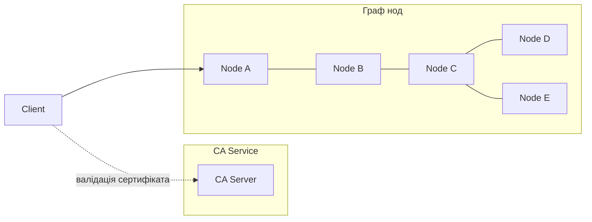
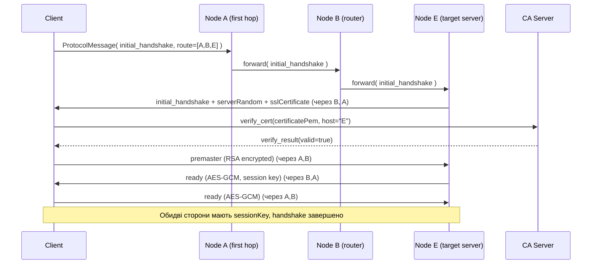
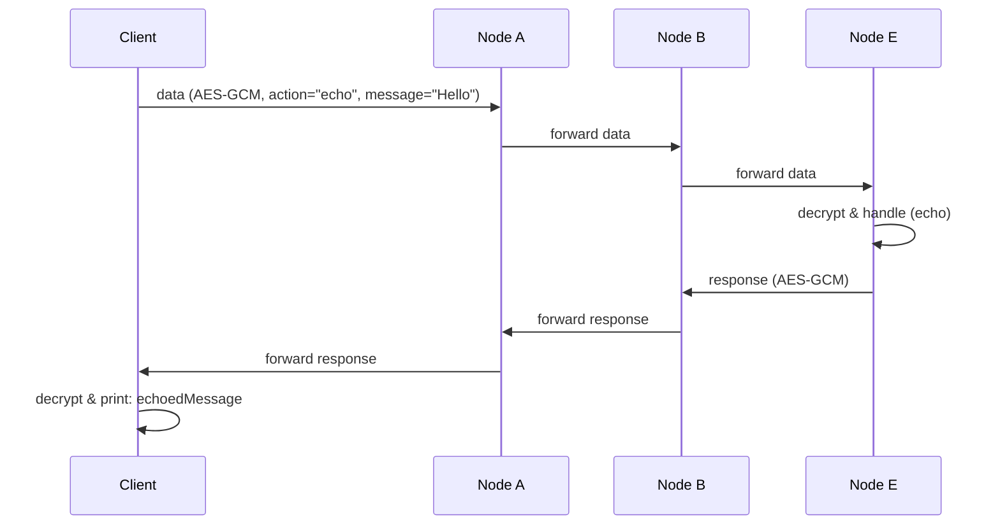
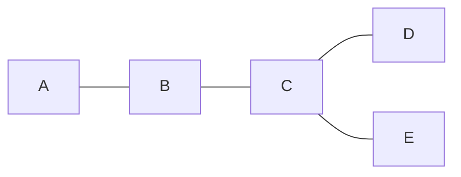

# TLS Topology RGR (Node.js + TypeScript)

Імітація TLS/SSL «рукостискання» з:

- окремим **CA-сервером** (центр сертифікації),
- **розподіленою топологією** з кількох нод (граф),
- маршрутизацією **через проміжні вузли**,
- обмеженням розміру пакету (імітація повільного радіоканалу),
- передачею даних по захищеному каналу (echo / чат / файл).

Проєкт орієнтований під РГР: базовий + розширений варіант (з топологією, CA-сервером, обмеженнями пакета).

---

## 📊 Діаграми та документація

Для детального опису архітектури, інфраструктури та протоколів дивіться:

- **[ARCHITECTURE.md](./ARCHITECTURE.md)** - Архітектура системи, компоненти, безпека
- **[INFRASTRUCTURE.md](./INFRASTRUCTURE.md)** - Інфраструктура, топологія мережі, розгортання
- **[PROTOCOL_FLOW.md](./PROTOCOL_FLOW.md)** - Протоколи, послідовності повідомлень, state machines
- **[DIAGRAMS_INDEX.md](./DIAGRAMS_INDEX.md)** - Індекс всіх діаграм та швидкий довідник

Всі діаграми використовують Mermaid синтаксис і автоматично рендеряться на GitHub/GitLab.

---

## 1. Архітектура проєкту

### 1.1. Основні компоненти

- **CA Server (`ca-server.ts`)**

  - Зберігає **root CA сертифікат**.
  - Приймає запити `verify_cert`.
  - Перевіряє, що сертифікат ноди:
    - підписаний root CA,
    - валідний по часу,
    - відповідає хостнейму (CN).
  - Повертає відповідь `verify_result { valid: boolean }`.

- **Node Server (`node-server.ts`)**

  - Запускається окремим процесом для кожної ноди (`A`, `B`, `C`, ...).
  - Має власну пару ключ/сертифікат (`A.key` / `A.crt`).
  - Виступає:
    - як кінцевий TLS-сервер (якщо він останній у `route`);
    - як **маршрутизатор**, якщо він проміжний вузол у маршруті.

- **Client (`client.ts`)**
  - Ініціює «рукостискання» з цільовою нодою.
  - Запитує CA-сервер на валідацію сертифіката.
  - Виконує handshake (premaster, session key).
  - Далі шле зашифровані `data`-повідомлення (echo / чат / файл).

- **Broadcast Client (`broadcast-client.ts`)**
  - Відправляє повідомлення до всіх доступних нод у топології.
  - Знаходить всі досяжні ноди через граф (BFS).
  - Для кожної ноди встановлює окреме TLS-з'єднання через маршрут.
  - Збирає відповіді від усіх нод і виводить підсумок.

---

### 1.2. Логічна схема взаємодії



---

## 2. TLS-handshake і дані: послідовність подій

### 2.1. Handshake + CA верифікація



### 2.2. Обмін даними



---

## 3. Топологія та маршрути

Топологія описується рядком `routeMap`, наприклад:

```text
"A:B,B:C,C:D,C:E"
```

Це означає:



Маршрут між нодами шукається через `Graph.findRoute(from, to)` (BFS).
Клієнт:

1. Створює граф через `createMap(routeMap)`.
2. Знаходить маршрут `route = graph.findRoute(from, to)`.
3. Вкладає `route` в кожен `ProtocolMessage`.

Проміжні ноди:

- дивляться на `msg.route`,
- шукають свою позицію в масиві,
- пересилають дані наступній ноді.

---

## 4. Обмеження розміру пакету (повільний радіоканал)

У `helpers.ts`:

```ts
export const MAX_PACKET_SIZE = 64;

export const sendWithPacketLimit = (socket: net.Socket, buffer: Buffer) => {
  for (let offset = 0; offset < buffer.length; offset += MAX_PACKET_SIZE) {
    const chunk = buffer.subarray(offset, offset + MAX_PACKET_SIZE);
    socket.write(chunk);
  }
};
```

Усі місця, де щось відправляється в сокет, використовують саме `sendWithPacketLimit` замість прямого `socket.write(buffer)`.

Це:

- ріже будь-який логічно цілісний протокол-пакет на шматки по 64 байти,
- імітує повільний/ненадійний радіоканал,
- змушує `DataHandler` адекватно збирати шматки по `Content-Length`.

---

## 5. Структура проєкту

```text
.
├── package.json
├── tsconfig.json
├── generate-certs.ps1
├── src
│   ├── helpers.ts
│   ├── graph.ts
│   ├── ca-server.ts
│   ├── node-server.ts
│   ├── client.ts
│   ├── broadcast-client.ts
│   └── protocol
│       ├── messages.ts
│       ├── dataHandler.ts
│       ├── handshakeClient.ts
│       └── handshakeServer.ts
└── secrets
    ├── rootCA.crt
    ├── rootCA.key
    ├── node_A
    │   ├── A.key
    │   └── A.crt
    ├── node_B
    │   ├── B.key
    │   └── B.crt
    └── ...
```

---

## 6. Встановлення та підготовка

### 6.1. Передумови

- **Node.js** (рекомендовано >= 18)
- **npm**
- **OpenSSL** у PATH (для генерації сертифікатів)
- Windows (основний сценарій) + PowerShell

### 6.2. Встановлення залежностей

```bash
npm install
```

---

## 7. Генерація ключів і сертифікатів

В корені проєкту є скрипт `generate-certs.ps1`, який:

- створює `secrets/` і всередині нього:

  - `rootCA.key`, `rootCA.crt`,
  - для кожної ноди (A–E): директорию `node_X` з `X.key` і `X.crt`.

Запуск:

```powershell
# (опційно) дозволити скрипти в цьому сеансі
Set-ExecutionPolicy -Scope Process -ExecutionPolicy Bypass

# згенерувати сертифікати для A,B,C,D,E
powershell -ExecutionPolicy Bypass -File .\generate-certs.ps1
```

Якщо треба інші ноди:

```powershell
powershell -ExecutionPolicy Bypass -File .\generate-certs.ps1 -Nodes A,B,C,D,E,F
```

---

## 8. Запуск компонентів

### 8.1. Запуск CA-сервера

```bash
npx ts-node src/ca-server.ts --port 9000
```

Аргументи:

- `--port` – порт CA (за замовчуванням 9000).

### 8.2. Запуск нод

Запускаємо в **окремих терміналах**:

```bash
# Node A
npx ts-node src/node-server.ts --name A --port 7000

# Node B
npx ts-node src/node-server.ts --name B --port 7001

# Node C
npx ts-node src/node-server.ts --name C --port 7002

# Node D
npx ts-node src/node-server.ts --name D --port 7003

# Node E
npx ts-node src/node-server.ts --name E --port 7004
```

> Порти можна не вказувати — є проста функція `guessPortForNode`, яка рахує порт від літери ноди. Але для явності краще передати `--port`.

### 8.3. Запуск клієнта (echo)

```bash
npx ts-node src/client.ts ^
  --from A ^
  --to E ^
  --routeMap "A:B,B:C,C:D,C:E" ^
  --caHost localhost ^
  --caPort 9000 ^
  --message "Hello secure world"
```

- `--from` – стартова нода для маршруту (логічна, клієнт підключається саме до неї).
- `--to` – цільова нода (кінцевий TLS-сервер).
- `--routeMap` – топологія графа.
- `--message` – текстовий echo-меседж.

Клієнт:

1. Знаходить маршрут `A -> B -> C -> E`.
2. Встановлює TCP до `A`.
3. Робить handshake до `E` через `A` і `C`.
4. Шле зашифрований `echo` і виводить розшифровану відповідь.

### 8.4. Запуск клієнта (файл)

```bash
npx ts-node src/client.ts ^
  --from A ^
  --to E ^
  --routeMap "A:B,B:C,C:D,C:E" ^
  --caHost localhost ^
  --caPort 9000 ^
  --file .\example.txt
```

- Клієнт прочитає `example.txt`,
- запакує в `action="chat", message="[FILE example.txt]\n<вміст>"`,
- зашифрує і відправить до `E`.

### 8.5. Запуск Broadcast

Broadcast відправляє повідомлення до всіх доступних нод у топології з урахуванням маршрутів.

**Важливо:** Перед запуском broadcast необхідно запустити:
- CA-сервер (порт 9000)
- Всі ноди, які є в `routeMap`

**Запуск:**

```bash
npx ts-node src/broadcast-client.ts \
  --from A \
  --routeMap "A:B,B:C,C:D" \
  --message "Broadcast message" \
  --action echo
```

**Параметри:**

- `--from` – стартова нода для пошуку доступних нод (за замовчуванням `A`)
- `--routeMap` – топологія графа (за замовчуванням `A:B,B:C,C:D,C:E`)
- `--message` – повідомлення для відправки (за замовчуванням `Broadcast message`)
- `--action` – тип дії: `echo`, `chat`, або `broadcast` (за замовчуванням `echo`)
- `--caHost` – хост CA-сервера (за замовчуванням `localhost`)
- `--caPort` – порт CA-сервера (за замовчуванням `9000`)

**Як працює:**

1. Broadcast-клієнт створює граф з `routeMap`
2. Знаходить всі досяжні ноди від стартової ноди через BFS (`getAllReachableNodes`)
3. Для кожної ноди:
   - Знаходить маршрут через топологію (`findRoute`)
   - Встановлює TLS-з'єднання через маршрут (handshake)
   - Відправляє зашифроване повідомлення
   - Отримує та розшифровує відповідь
4. Виводить підсумок з відповідями від усіх нод

**Приклад виводу:**

```
[Broadcast] Starting from node A
[Broadcast] Route map: A:B,B:C,C:D
[Broadcast] Nodes in graph: A, B, C, D
[Broadcast] Reachable nodes: A, B, C, D
[Broadcast] Sending message: "Broadcast message"

[Broadcast] Sending to A via route: A
[Broadcast] Response from A: {
  "echoedMessage": "[A] Broadcast message"
}

[Broadcast] Sending to B via route: A -> B
[Broadcast] Response from B: {
  "echoedMessage": "[B] Broadcast message"
}

...

==================================================
Broadcast Summary:
==================================================
Total nodes: 4
Successful: 4
Failed: 0
```

**Примітка:** Через особливості обробки аргументів в PowerShell та npm, рекомендується використовувати прямий запуск через `npx ts-node` замість `npm run start:broadcast`.

---

## 9. Відповідність вимогам РГР

| Пункт РГР                                          | Реалізація у проєкті                                    |
| -------------------------------------------------- | ------------------------------------------------------- |
| Клієнт шле random «привіт»                         | `ClientHandShakeHandler.initiateHandShake()` (`random`) |
| Сервер шле random + сертифікат                     | `ServerHandShakeHandler.handleInitialHandShake()`       |
| Перевірка сертифіката в центрі сертифікації        | `verifyCertificateViaCa()` + `ca-server.ts`             |
| Клієнт шле premaster, зашифрований public key      | `Premaster.encrypt()` + message `type: 'premaster'`     |
| Сервер розшифровує premaster                       | `Premaster.decrypt()` на сервері                        |
| Генерація ключів сеансу з random + premaster       | `genSessionKey()` (HKDF)                                |
| Повідомлення "ready", зашифроване сеансовим ключем | `READY_MESSAGE` + `Message.encrypt()`                   |
| Подальше симетричне шифрування                     | `Message.encrypt/decrypt()` (AES-256-GCM)               |
| Передача даних (чат / файл)                        | `client.ts` (`echo` / `chat`)                           |
| Розподілена топологія 5+ нод                       | `graph.ts` + `routeMap` + декілька `node-server`        |
| Handshake між будь-якою парою через проміжні ноди  | `route` + форвардинг у `node-server.ts`                 |
| Обмеження розміру пакету                           | `MAX_PACKET_SIZE` + `sendWithPacketLimit()`             |
| Broadcast з урахуванням топології                  | `broadcast-client.ts` + `graph.getAllReachableNodes()`   |

> Broadcast реалізовано як окремий клієнт, який обходить усі досяжні ноди в графі через BFS і відправляє їм повідомлення по побудованих маршрутах з повним TLS handshake для кожної ноди.

---

## 10. Ідеї для розширення / допилювання

- Логи:

  - логування кожного кроку handshake (з random, premaster, session key),
  - логування маршруту (на проміжних нодах).

- Документація:

  - вставити скріни терміналів у звіт (CA, ноди, клієнт),
  - окремо описати HKDF, AES-GCM, RSA-OAEP.

---

Якщо потрібно, можу:

- адаптувати README під формат саме твого звіту (з підрозділами 1–5, таблицями / блок-схемами),
- або додати ще 1–2 Mermaid-діаграми (наприклад, для структури файлів чи внутрішнього стану handshake-класів).
